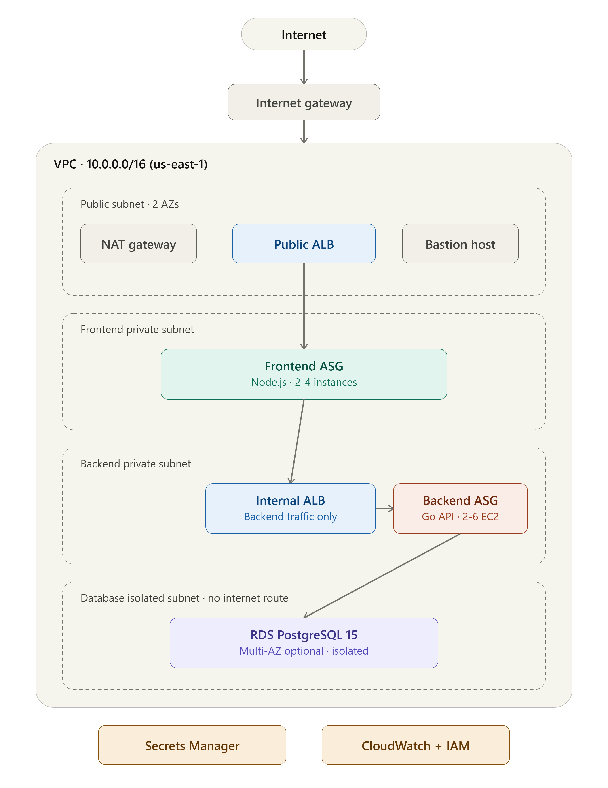

# TerraTier — Production-Grade 3-Tier AWS Architecture with Terraform

[](https://www.terraform.io/)
[](https://registry.terraform.io/providers/hashicorp/aws/latest)
[](https://go.dev/)
[](https://nodejs.org/)
[](LICENSE)

A fully isolated, auto-scaling, 3-tier web architecture on AWS, provisioned entirely with Terraform. A Go REST API and a Node.js frontend run behind two Application Load Balancers, scale automatically based on CPU load, store credentials in Secrets Manager instead of plaintext config, and ship logs and metrics to CloudWatch — with zero SSH keys required to manage the fleet thanks to SSM Session Manager.

This repository is the infrastructure layer for a small "DevOps Goal Tracker" demo app. The app itself is intentionally simple — the point of this project is the platform underneath it: networking, security boundaries, auto-scaling, secrets management, and observability, built the way you'd actually want them in a junior production environment.

## Table of contents

- [Architecture](#architecture)
- [Why this design](#why-this-design)
- [Tech stack](#tech-stack)
- [Repository structure](#repository-structure)
- [Prerequisites](#prerequisites)
- [Quick start](#quick-start)
- [Terraform command reference](#terraform-command-reference)
- [Configuration (tfvars)](#configuration-tfvars)
- [Module documentation (terraform-docs)](#module-documentation-terraform-docs)
- [Networking and security](#networking-and-security)
- [Observability](#observability)
- [Cost considerations](#cost-considerations)
- [Cleanup](#cleanup)
- [Troubleshooting](#troubleshooting)
- [Roadmap](#roadmap)
- [License](#license)
- [Author](#author)

## Architecture



*(see [ARCHITECTURE.md](terraform-infra/ARCHITECTURE.md) for the full text-based breakdown of every component, traffic flow, and scaling policy.)*

At a glance:

- One VPC, two Availability Zones, four subnet tiers: **public** (ALB, NAT gateways, bastion), **frontend private**, **backend private**, and **database isolated** (no route to the internet, by design).
- A public-facing ALB routes browser traffic to a Node.js frontend Auto Scaling Group; the frontend talks to an **internal** ALB, which routes to a Go backend Auto Scaling Group; the backend is the only tier allowed to reach RDS PostgreSQL.
- A bastion host (with SSM Session Manager support) is the only inbound SSH path, and only to the public subnet.
- Database credentials are generated randomly and stored in AWS Secrets Manager; nothing is hardcoded in Terraform state or environment files.

## Why this design

A few decisions are worth calling out, since they're the parts an interviewer is likely to ask about:

**Two ALBs, not one.** The frontend and backend are scaled and deployed independently, each behind its own ALB (one public, one internal-only). This mirrors how you'd front a real microservice rather than a monolith, and it means the backend API is never directly reachable from the internet — only from the frontend tier's security group.

**Four subnet tiers, not the usual three.** Most "3-tier" Terraform examples really only split public/private/data. Here, the private tier is split again into frontend and backend subnets with their own security groups and route tables, so a compromised frontend instance still can't reach the database security group directly — it has to go through the internal ALB and backend security group first.

**Bastion *and* SSM, not bastion *or* SSM.** The bastion gives you a familiar SSH jump host pattern (useful for debugging, demos, and interviews), while the IAM instance profile attached to every EC2 instance also grants SSM Session Manager access — the actual recommended way to manage instances day-to-day without distributing SSH keys at all.

**Secrets Manager over environment variables.** The RDS master password is generated with `random_password`, written once to Secrets Manager, and read at boot time by the backend's user-data script via the AWS CLI and `jq`. Terraform state still contains the password (a known limitation of this pattern — see [Roadmap](#roadmap)), but nothing is checked into source control or baked into the AMI/Docker image.

**Single NAT Gateway by default.** `single_nat_gateway = true` in `terraform.tfvars` trades some resilience (one NAT Gateway is a single point of failure if its AZ goes down) for roughly half the NAT cost. Flip it to `false` for a production environment that needs per-AZ NAT redundancy.

**IMDSv2 enforced everywhere.** Every launch template and the bastion instance set `http_tokens = "required"`, closing the classic SSRF-to-credential-theft path that IMDSv1 leaves open.

## Tech stack

| Layer | Technology |
|---|---|
| Infrastructure as Code | Terraform >= 1.13, AWS provider ~> 6.0 |
| Compute | EC2 Auto Scaling Groups (frontend + backend), launch templates, Ubuntu 22.04 LTS |
| Containers | Docker, multi-stage builds, distroless runtime images |
| Backend API | Go 1.23, Gin, `lib/pq`, Prometheus client |
| Frontend | Node.js 18, Express, vanilla HTML/CSS/JS |
| Database | Amazon RDS for PostgreSQL 15 |
| Load balancing | 2x Application Load Balancer (public + internal) |
| Secrets | AWS Secrets Manager |
| Access | Bastion host + AWS Systems Manager Session Manager |
| Observability | CloudWatch Logs, CloudWatch Alarms |
| Identity | IAM roles/instance profiles (least-privilege per service) |

## Repository structure

```
.
├── backend/                     # Go REST API (Gin)
│   ├── main.go
│   ├── go.mod / go.sum
│   └── Dockerfile               # multi-stage, distroless runtime
├── frontend/                    # Node.js/Express proxy + static UI
│   ├── server.js
│   ├── package.json
│   ├── public/index.html
│   └── Dockerfile               # multi-stage, distroless runtime
├── terraform-infra/
│   ├── modules/
│   │   ├── vpc/                 # VPC, 4 subnet tiers, IGW, NAT, route tables
│   │   ├── security-groups/     # ALB, internal ALB, bastion, frontend, backend, RDS SGs
│   │   ├── alb/                 # reusable ALB + target group + listener module
│   │   ├── frontend-asg/        # frontend launch template + ASG + scaling policy
│   │   ├── backend-asg/         # backend launch template + ASG + scaling policy
│   │   ├── bastion/              # bastion EC2 + EIP
│   │   ├── rds/                  # RDS PostgreSQL + subnet group + parameter group
│   │   ├── secrets/               # Secrets Manager secret + version
│   │   └── iam/                   # EC2 instance role/profile (SSM, CloudWatch, Secrets)
│   ├── environments/
│   │   └── dev/
│   │       ├── main.tf            # wires every module together
│   │       ├── variables.tf
│   │       ├── outputs.tf
│   │       ├── provider.tf
│   │       └── terraform.tfvars.example
│   ├── scripts/
│   │   ├── deploy.sh              # init/validate/plan/apply with safety prompts
│   │   ├── build_and_push.sh      # build + push frontend/backend images to Docker Hub
│   │   ├── frontend_user_data.sh  # EC2 bootstrap: Docker, AWS CLI, pull + run frontend
│   │   └── backend_user_data.sh   # EC2 bootstrap: Docker, secrets, pull + run backend, CW agent
│   └── ARCHITECTURE.md            # full text-based architecture deep dive
├── assets/
│   └── architecture-diagram.png   # export your draw.io diagram here
├── .terraform-docs.yml
├── .gitignore
├── LICENSE
└── README.md
```

## Prerequisites

- [Terraform](https://developer.hashicorp.com/terraform/downloads) >= 1.13
- [AWS CLI v2](https://docs.aws.amazon.com/cli/latest/userguide/getting-started-install.html), configured with credentials (`aws configure`)
- An AWS account with permissions to create VPCs, EC2, RDS, ALB, IAM, and Secrets Manager resources
- [Docker](https://docs.docker.com/get-docker/), for building the frontend/backend images
- A [Docker Hub](https://hub.docker.com/) account (or swap in Amazon ECR — see [Roadmap](#roadmap))
- An existing EC2 key pair in your target region (for the bastion and SSH fallback)
- [terraform-docs](https://terraform-docs.io/user-guide/installation/) (optional, only needed to regenerate the module input/output tables)

## Quick start

```bash
# 1. Clone
git clone https://github.com/vatul16/terratier.git
cd terratier

# 2. Build and push the application images to Docker Hub
./terraform-infra/scripts/build_and_push.sh atulv16

# 3. Configure the dev environment
cd terraform-infra/environments/dev
cp terraform.tfvars.example terraform.tfvars
# edit terraform.tfvars: set ssh_key_name, allowed_ssh_cidr, and the two docker_image values

# 4. Deploy (interactive, with safety checks)
cd ../..
./scripts/deploy.sh

# — or run the Terraform commands directly —
cd environments/dev
terraform init
terraform plan
terraform apply

# 5. Get the application URL
terraform output -raw application_url
```

Give the Auto Scaling Groups 5–10 minutes after `apply` finishes — instances need to boot, install Docker, pull images, and pass health checks before the ALB marks them healthy.

## Terraform command reference

Run all of these from `terraform-infra/environments/dev`, unless noted.

| Command | Purpose |
|---|---|
| `terraform init` | Download providers and initialize the working directory |
| `terraform validate` | Check configuration syntax and internal consistency |
| `terraform fmt -recursive` | Auto-format all `.tf` files in the repo |
| `terraform plan` | Preview changes before applying |
| `terraform plan -out=tfplan` | Save a plan to apply later (used by `scripts/deploy.sh`) |
| `terraform apply` | Create/update infrastructure |
| `terraform apply tfplan` | Apply a previously saved plan |
| `terraform output` | Show all outputs, including the helpful command cheat-sheet |
| `terraform output -raw application_url` | Print just the app URL |
| `terraform destroy` | Tear down everything this configuration manages |
| `terraform state list` | List every resource currently tracked in state |
| `terraform graph \| dot -Tsvg > graph.svg` | Render a dependency graph (requires Graphviz) |

## Configuration (tfvars)

All variables live in `terraform-infra/environments/dev/variables.tf`, with example values in `terraform.tfvars.example`. The ones you must change before deploying:

| Variable | Description | Example |
|---|---|---|
| `ssh_key_name` | Existing EC2 key pair name in your target region | `"my-keypair"` |
| `allowed_ssh_cidr` | Your IP, restricted — never leave this as `0.0.0.0/0` | `"203.0.113.4/32"` |
| `frontend_docker_image` | Frontend image pushed to Docker Hub/ECR | `"atulv16/goal-tracker-frontend:latest"` |
| `backend_docker_image` | Backend image pushed to Docker Hub/ECR | `"atulv16/goal-tracker-backend:latest"` |

Everything else (instance sizes, ASG min/max/desired, VPC CIDRs, RDS engine version, NAT gateway strategy) has a sensible default for a dev/demo environment — see `variables.tf` for the full list and descriptions.

## Networking and security

- **Subnet isolation**: public → frontend-private → backend-private → database-isolated, each with its own route table. Only the public tier has a route to the Internet Gateway; the database tier has no internet route at all.
- **Security groups are scoped to security groups, not CIDRs**, wherever possible — the RDS SG only allows inbound 5432 from the backend SG, the backend SG only allows inbound 8080 from the internal ALB SG, and so on. See `terraform-infra/modules/security-groups/main.tf` for the full chain.
- **Encryption at rest** for both EBS volumes (launch templates) and RDS storage.
- **IMDSv2 required** (`http_tokens = "required"`) on every EC2 resource.
- **Least-privilege IAM**: the shared EC2 instance role grants exactly three things — SSM Session Manager, CloudWatch Agent, and read-only access to the specific Secrets Manager secret holding DB credentials. No EC2 instance can call arbitrary AWS APIs.
- **No SSH keys for app instances**: frontend/backend instances accept SSH only from the bastion's security group, but SSM Session Manager is the intended path for both.

Full breakdown of every security group rule and traffic path: [`terraform-infra/ARCHITECTURE.md`](terraform-infra/ARCHITECTURE.md).

## Observability

- The backend exposes Prometheus-compatible metrics at `/metrics` (request counters by path, goal-add/remove counters) and a liveness check at `/health`.
- The ALB target group health check hits `/health` every 30 seconds; 2 consecutive successes mark an instance healthy, 3 consecutive failures pull it from rotation.
- CloudWatch Agent ships `/var/log/user-data.log` from every instance to `/aws/ec2/<environment>-<project>/{frontend,backend}` log groups, plus basic CPU/memory metrics.
- CloudWatch Alarms fire on sustained high CPU (>80% for 2 consecutive 2-minute periods) for both ASGs, and on any unhealthy target in the frontend ALB target group.
- A cron job on each instance independently re-checks the application's health every 5 minutes and restarts the container if it's failing — a cheap, ASG-independent self-healing layer.

```bash
aws logs tail /aws/ec2/dev-goal-tracker/backend --follow
aws logs tail /aws/ec2/dev-goal-tracker/frontend --follow
```

## Cost considerations

This is sized for a personal demo/portfolio environment, not production load. Rough always-on monthly cost in `us-east-1` with default settings (2x `t3.micro` frontend, 2x `t3.micro` backend, 1x `db.t3.micro` RDS single-AZ, 1x NAT Gateway, 1x public + 1x internal ALB): in the neighborhood of **$120–160/month**, dominated by the two ALBs (~$16/month each plus LCU charges) and the NAT Gateway (~$32/month plus data processing). The single biggest lever is `single_nat_gateway` (already `true` by default) and simply destroying the stack when you're not actively demoing it — see [Cleanup](#cleanup).

## Cleanup

```bash
cd terraform-infra/environments/dev
terraform destroy
```

Confirm with `yes` when prompted. This removes every resource Terraform created, including the RDS instance (the `skip_final_snapshot = true` default means no final snapshot is taken — change this before destroying anything you care about). The Secrets Manager secret is scheduled for deletion after `recovery_window_in_days` (0 by default, meaning immediate deletion in dev).

## Troubleshooting

| Symptom | Likely cause | Fix |
|---|---|---|
| `terraform apply` fails on `aws_db_instance` | Engine version not available in your region, or DB subnet group spans <2 AZs | Check `aws rds describe-db-engine-versions`; confirm `availability_zones` has 2+ entries |
| ALB shows targets as `unhealthy` | App container failed to start, or health check path/port mismatch | SSM into the instance, run `docker logs goal-tracker-frontend` / `-backend`, check `/var/log/user-data.log` |
| Backend can't reach RDS | Security group rule missing, or RDS not yet available when the instance booted | Check `aws_security_group.rds` ingress; the backend user-data script retries DNS/connectivity for ~3 minutes before giving up |
| `terraform destroy` hangs on the VPC | NAT Gateway or ENI not fully released yet | Wait a few minutes and retry, or check the AWS console for orphaned ENIs |
| Can't pull Docker image on instance boot | Docker Hub rate limiting (anonymous pulls), or wrong image name in `terraform.tfvars` | Set `dockerhub_username`/`dockerhub_password`, or move to ECR |

## Roadmap

- Move container images from Docker Hub to **Amazon ECR**, removing the rate-limit and credential-sharing concerns entirely
- Add a **GitHub Actions** pipeline: `terraform fmt -check` + `validate` + `plan` on PRs, `apply` on merge to `main`, plus automated image build/push
- Move Terraform state to an **S3 backend with DynamoDB locking** (already scaffolded, commented out in `provider.tf`)
- Add an **ACM certificate + HTTPS listener** on the public ALB, with HTTP→HTTPS redirect
- Pull the RDS master password from Secrets Manager via a **data source** rather than passing it through a Terraform variable, to keep it out of plan output
- Add [Terratest](https://terratest.gruntwork.io/) coverage for the VPC and security-groups modules
- Evaluate moving Auto Scaling Groups to **instance refresh with a rolling deployment policy** for true zero-downtime releases

## License

This project is licensed under the [MIT License](LICENSE).

## Author

**Atul Vishwakarma**
Cloud/DevOps Engineer · [LinkedIn](https://linkedin.com/in/vatul16) · [GitHub](https://github.com/vatul16)

If you have questions about a specific design decision, see [`ARTICLE`](https://dev.to/vatul16/building-a-production-grade-3-tier-aws-architecture-with-terraform-design-decisions-trade-offs-370f) for the full write-up of why this architecture looks the way it does.
